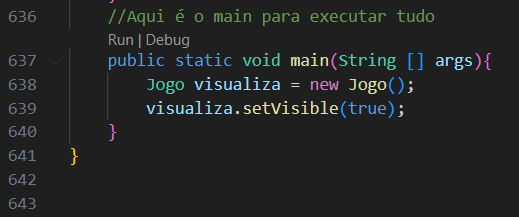
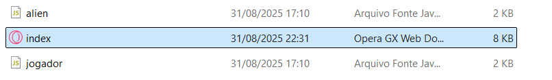
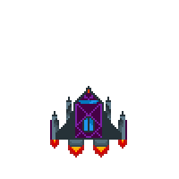
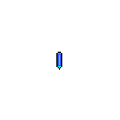

É recomendado que o readme seja lido diretamente no github pra conseguir ver as imagens do readme
# ProjetoFinalPOO

Membros:Gustavo César Barreto Santana,
        Caio Mendonça Barreto de Brito

Repositório: https://github.com/CaioM0909/ProjetoFinalPOO

Tema: O tema do trabalho é um jogo baseado em Space Invaders utilizando o paradigma orientado ao objeto nas linguagens Java e JavaScript

Obs: O jogo foi testado para linux e windows e pode possuir alguns problemas com o aúdio por conta do arquivo WAV e com o consumo de GPU dado o grande número de gifs rodando simultaneamente.

Execução dos arquivos: Em java: Após baixar a pasta, abrir a pasta jogoJava e no VSCode ir em Jogo.java descer até a main e dar run.

Em javaScript após baixar, ir na pasta javaScript e executar o index.html.

# Discussão das features
Discussão do que desenvolvemos: Primeiro desenvolvemos o jogo na linguagem Java para ter uma base melhor de como desenvolver-lo dentro da linguagem secundária(JavaScript), por meio disso tomamos como exemplo o jogo disponibilizado para referência dentro da explicação do projeto e seguimos a maioria das características deste exemplo com algumas alterações autorais para tornar o jogo único.
Algumas das coisas que implemetamos foram: 

A movimentação dos aliens: Eles são objetos feitos com gifs que após chegarem as bordas da tela tem a direção de seu movimento invertido e um aumento em seu Y para descer na tela.

A movimentação do jogador: Que capta caso as teclas A ou D estejam pressionadas fazendo o X do jogador variar mas sem sair das bordas da tela.

Vidas: Em que são gifs de corações que indicam quantos tiros o jogador pode levar e ao acabar o jogo é definido com perdido.

Tiros do jogador: Em que é capttado caso a tecla SPACEBAR(Espaço) esteja pressionada criando um objeto Tiro que possui colisão e caso atinja um alien apaga os 2 objetos tanto o tiro quanto o alien atingido.

Tiros dos Aliens: São 3 tiros que pertencem ao mesmo objeto e é randomizado qual deles será utilizado, sendo eles com velocidades diferentes eles possuem hitbox que removem vidas do jogador.

NaveAlien: Uma nave que se move diferente dos aliens, ela se move continuamente e vai para a direita e ao bater na borda volta para a esquerda e sai da tela voltando após um minuto.

Sons: Possui botão que ativa o som e permite ativar e desativar a música de background além de possuir um som de gameOver ao perder.

Colisões: Possuem "HitBox" em objetos que podem ser atingidos como os Aliens a NaveAlien o Jogador e os Tiros.

Sistema de Pontuação: Cada Alien possui uma pontuação específica que aumenta o Score ao atingi-lo, além de possuir uma váriavel que define o maior score já obtido.

# Discussão do OO

Discussão da OO na segunda linguagem adotada: Dentro do JavaScript criamos uma classe chamada Objeto para servir como superclasse para todas as classes de objeto. 

classe jogador: Começando pela classe jogador ela funciona como objeto para a nave do jogador primeiro cria um elemento como imagem para utilizar na tela e possui funções relacionadas a movimentação(update()), atirar(update()) e remoção(remover()) da nave, além da hitbox(getHitbox()) da nave que serve para identificar o dano tomado por ela.

classe tiro: A classe tiro ,seguindo o mesmo principio da classe jogador, cria um elemento como imagem para utilizar na tela e possui funções para construir a lógica do tiro como a hitbox(getHitbox()), movimentação(update()) e remoção(remover()).

classe alien: A classe alien possui algumas diferenciações das classes anteriores por possuir as subclasses alien1, alien2 e alien3 que são utilizadas para diferenciar as imagens dos aliens. Da mesma maneira existem as funções para movimentação(update()), remoção(remover()) e hitbox(getHitbox()).

classe naveAlien: A classe naveAlien está relacionada a um objeto especial dentro das mecânicas do jogo, este é um objeto que aparece pela primeira vez 10 segundos após o inicio do jogo e 60 segundos após desaparecer ele continua sendo criado, sendo um objeto especial ele possui 3 vidas para ser removido e possui uma pontuação de 1000 pontos para cada naveAlien morta. As funções que ele possui são, assim como nas outras classes, movimentação(update()), remoção(remover()), hitbox(getHitbox()) e como diferencial a função PerdeVida() que reduz a vida da naveAlien.

classe tiroAlien : A classe tiroAlien funciona como um objeto gerado a partir dos aliens para causar dano ao jogador, por meio de uma função ele sorteia uma das três opções de tiros com chances diferentes de serem escolhidos de acordo com suas respectivas velocidades(ex: o tiro mais rapido tem mais chances de ser escolhido), o resto das funções segue o mesmo princípio das anteriores como a função de movimentação(updade()), remoção(remover()) e hitbox(getHitbox()).

                
 

classe jogo: A classe jogo funciona como classe principal com relação a implementar as mecanicas do jogo, ela reune as funções e variáveis presentes dentro de todas as outras classes para possibilitar a execução do jogo. Ela possui funções como score() para pontuar a cada remoção de objeto causada pelo tiro do jogador, redimensionaCanvas() funciona como redimensionador para as proporções da tela ficarem centralizadas dentro do navegador, adicionarTiro() serve para colocar o objeto tiro dentro do array objetos criado dentro da classe jogo, adicionarTiroAlien() seguindo o mesmo principio do adicionarTiro() ela serve para colocar o tiroAlien dentro do array objetos, iniciar() é uma função associada ao "botaoJogar"(que é um botão criado dentro do html para iniciar o jogo) tendo como funcionalidade iniciar as principais funções do jogo e definir algumas variáveis importantes, criarNaveAlien() funciona como meio para criar uma nova NaveAlien na tela toda vez que é chamada estando associada à variável naveAlienTimer que cria uma naveAlien a cada determinada quantidade de tempo, pararNaveAlien() essa função tem como objetivo parar a criação de naves aliens quando a derrota é declarada, criarAliens() uma função para a criação da fileira de aliens, colisaoTiroJogador() serve para identificar quando o tiro do jogador colide com um objeto inimigo remover-lo da tela, colisaoTiroAlien() seguindo a mesma lógica da função colisaoTiroJogador() essa função faz com que os tiros dos aliens identifiquem quando o objeto jogador colide com eles e diminui a quantidade de vida do jogador até chegar a zero resultando em gameover, loop() é uma função que serve para atualizar constantemente a funcionalidade das outras funções para garantir que elas estão sempre funcionando, colidiu() serve para identificar quando um objeto atinge a hitbox de outro objeto, moveAliens() função que faz os aliens se moverem para o lado e identificarem quando encostam na borda fazendo com que se movam para baixo e sigam para o lado oposto seguindo essa lógica até determinada altura que resulta no gameover, limpezaDados() ela faz uma limpeza em todos os elementos esvazia o array objetos, som() e set() funcionam em conjunto para iniciar a trilha sonora e pausar ela quando necessário.

